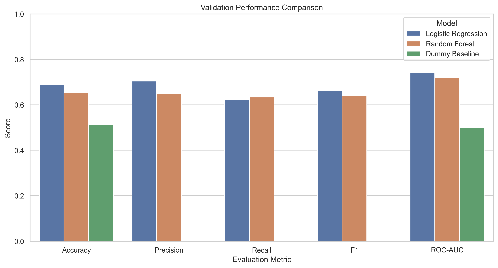
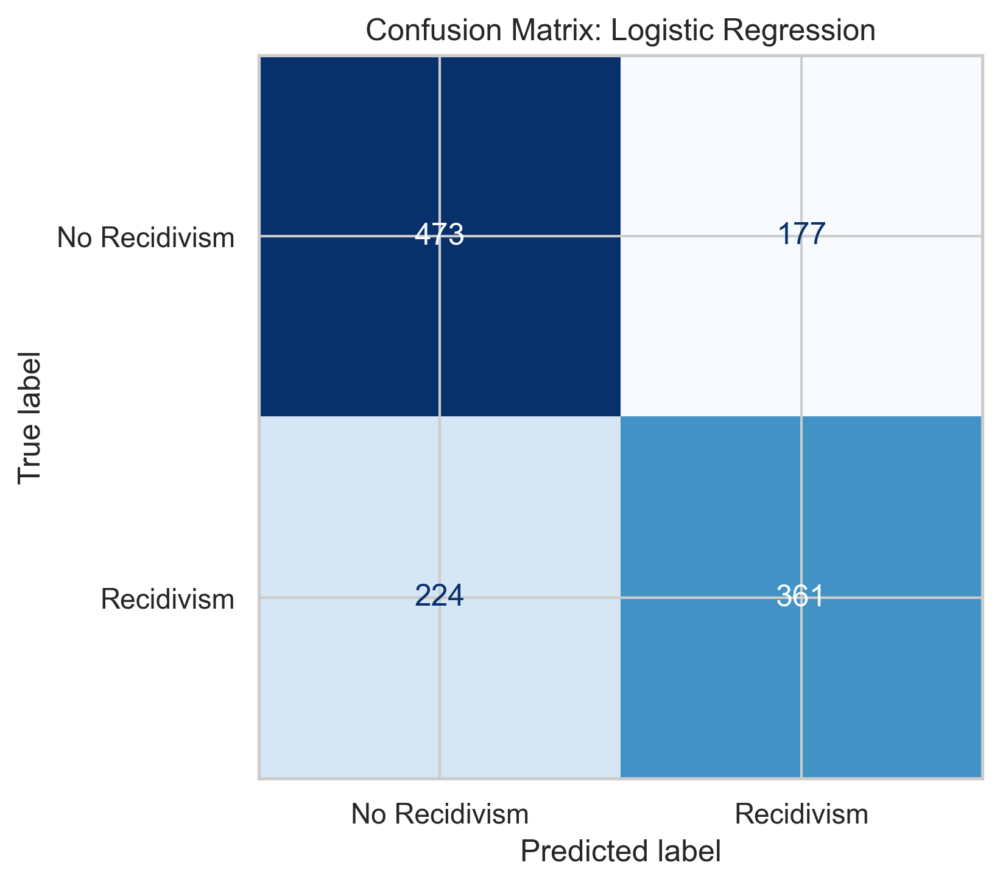
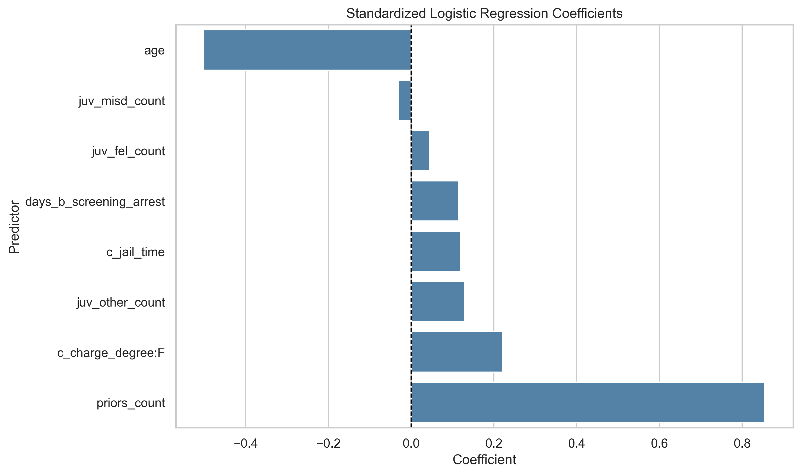
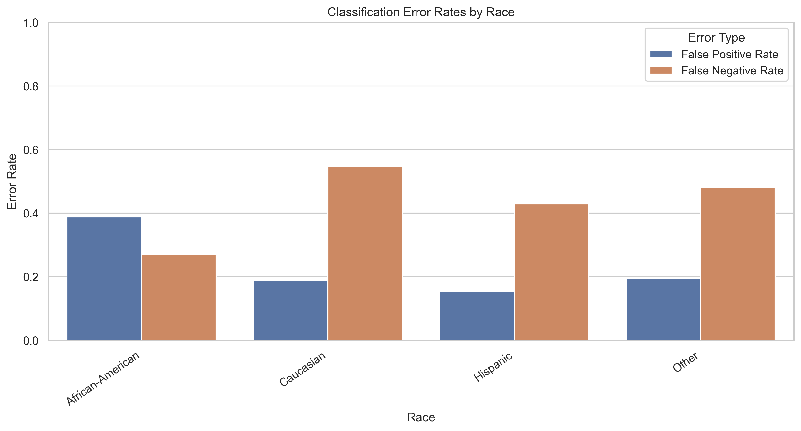

# Interpretable Recidivism Classification and Fairness Evaluation

## Project Overview

This project evaluates interpretable classification models for predicting recidivism outcomes using the COMPAS recidivism dataset. The workflow includes exploratory data analysis, leakage-free model development, comparison of Logistic Regression and Random Forest models against a baseline classifier, held-out test evaluation, coefficient interpretation, and subgroup fairness analysis.

## Project Background

This project was originally developed as a university course midterm project and later expanded into a personal portfolio project incorporating instructor feedback. The revised version strengthens the modelling workflow through leakage-free preprocessing, held-out test evaluation, expanded model performance metrics, and subgroup fairness analysis.

## Tools Used

- Python
- Pandas and NumPy
- Matplotlib and Seaborn
- Scikit-learn
- Hugging Face Datasets
- Jupyter Notebook

## Research Question

Can an interpretable classification model estimate recidivism outcomes from age, criminal-history, and case-related variables, and do the model's classification errors vary across demographic groups?

## Methods

- Conducted exploratory analysis of predictors and recidivism outcomes.
- Built leakage-free machine learning pipelines using Scikit-learn.
- Compared Dummy Classifier, Logistic Regression, and Random Forest models.
- Selected the final model using validation ROC-AUC.
- Evaluated final performance on an untouched held-out test dataset.
- Interpreted standardized Logistic Regression coefficients.
- Evaluated false positive and false negative rates across demographic groups.

## Key Results

The selected model was **Logistic Regression**, which achieved the following performance on the held-out test dataset:

| Metric | Score |
|---|---:|
| Accuracy | 0.675 |
| Precision | 0.671 |
| Recall | 0.617 |
| F1-score | 0.643 |
| ROC-AUC | 0.726 |

The strongest positive coefficient association was `priors_count`, while the strongest negative association was `age`.

Subgroup analysis identified meaningful differences in false positive and false negative rates across reported race and sex groups, highlighting the importance of evaluating model behaviour beyond overall predictive accuracy.

## Visualizations

### Validation Model Comparison



### Final Confusion Matrix



### Logistic Regression Coefficients



### Error Rates by Race



## Repository Structure

```text
recidivism_fairness_analysis.ipynb   Main analysis notebook
images/                               Exported figures used in the analysis
outputs/                              Exported model and fairness result tables
requirements.txt                      Required Python libraries
